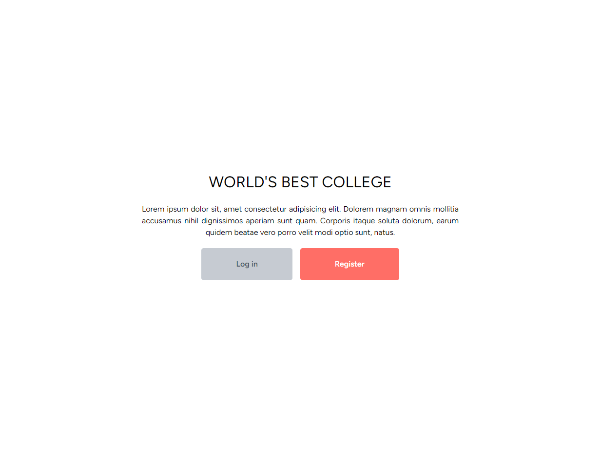
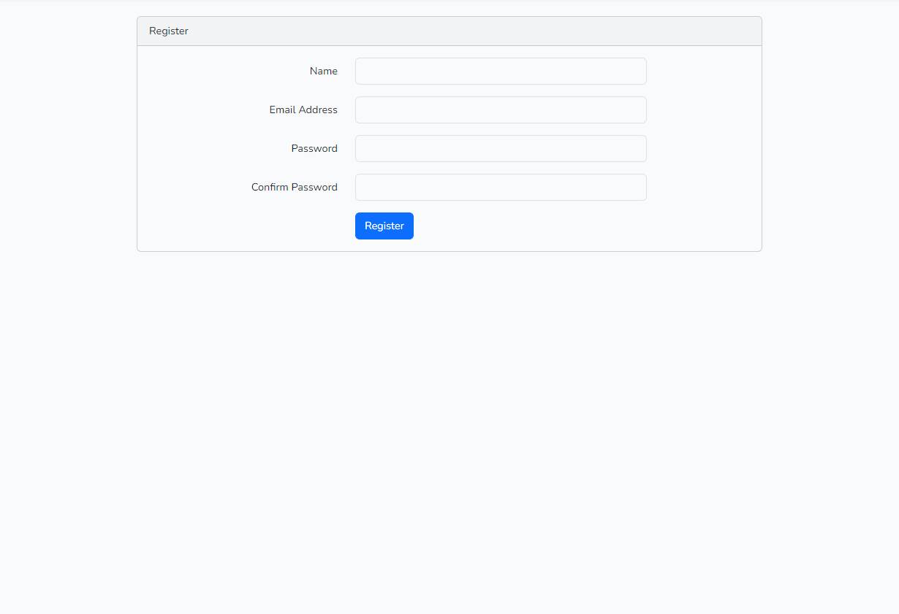
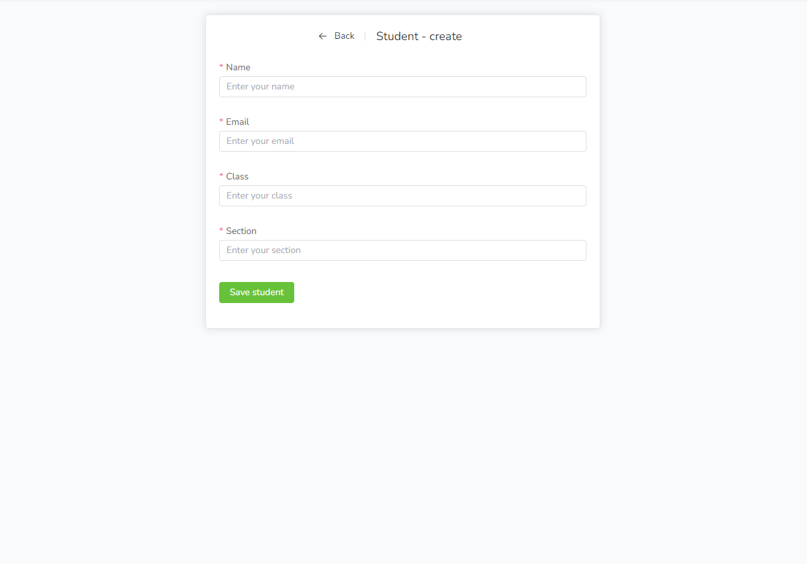
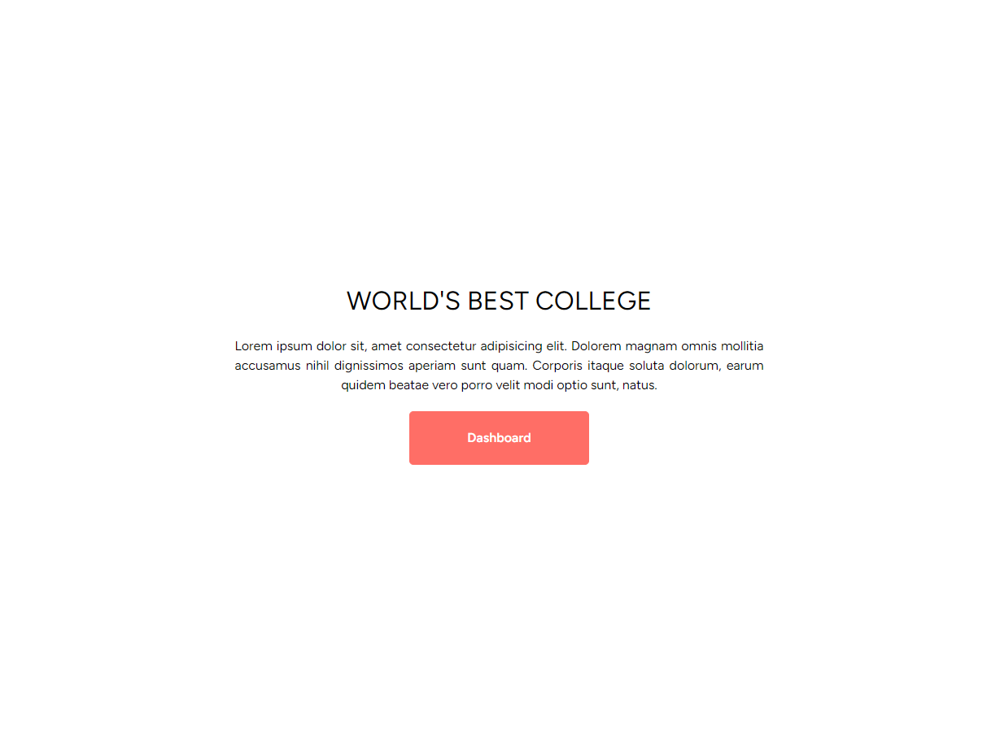

# Laravel Vue Students

The teacher at the school keep the data about the students' bookings. Student app is made with Laravel, Vue and Vuex.

## Browser Compatibility

All of the latest versions of <b>Chrome</b>, <b>Firefox</b>, <b>Edge</b> and <b>Opera</b> browsers are supported.

## Installation

#### Steps to install

<ol>
  <li>download<a href="https://www.apachefriends.org/download.html" target="_blank"> XAMPP</a></li>
  <li>download the folder/git clone the repo</li>
  <li>npm install</li>
  <li>composer install</li>
  <li>php artisan serve</li>
  <li>npm run dev</li>
  <li>access http://localhost/phpmyadmin</li>  
  <li>create new database and call it laravel</li>
  <li>in folder .env.example rename to .env</li>
  <li>php artisan migrate:refresh</li>
</ol>

## Screenshots

The website is made for booking in a school, so I made input fields for enter the students' data which will be managed by teachers. For the first time you have to register yourself, otherwise you can log in.

Complete the registration.

Fill the data. When you click Save button the data are sent in the database and it will redirect you to the list of students' data. You can also click Back to see a list of students' data.

List of students' data where you can delete and edit them and the table can be sorted by descending or ascending id. In case of need to search the data enter a letter, a word or a number. The item or items will be shown.

In the navigation bar there is a link home and when you click on the link it connects you to the home page where the Dashboard button is located. Click on the Dashboard connects you to student creation.

[Back to the top](#laravel-vue-students)
